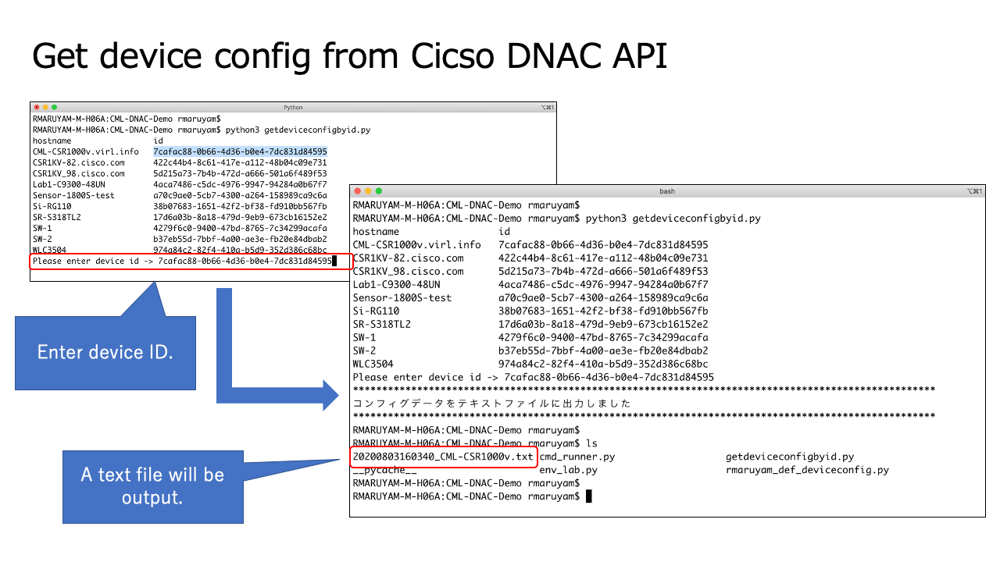

# Get device config from DNAC API

Problem: It's time-consuming and costly for engineers to retrieve configurations from numerous devices, as well as to log in every time.

Solution: CiscoDNACenter's APIs (command runner and get configuration) are used to automatically retrieve information about the device. The command runner allows you to define any command in a script. For configuration retrieval, the output information is converted to a text file.

# How the script works（Command runner）

# How the script works（Get configration）

